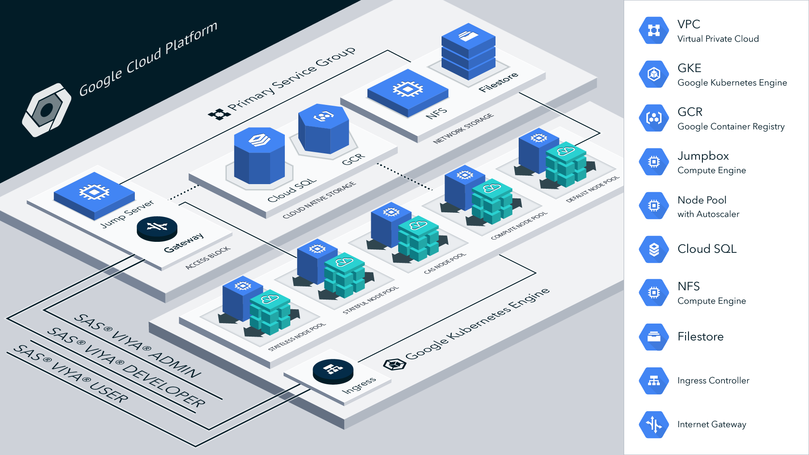

# SAS Viya 4 Infrastructure as Code (IaC) for Google Cloud

## Table of Contents

- [Overview](#overview)
- [Prerequisites](#prerequisites)
  - [Required](#required)
    - [Terraform](#terraform)
    - [Docker](#docker)
- [Getting Started](#getting-started)
  - [Clone this project](#clone-this-project)
  - [Authenticating Terraform to access Google Cloud](#authenticating-terraform-to-access-google-cloud)
  - [Customize Input Values](#customize-input-values)
- [Creating and Managing the Cloud Resources](#creating-and-managing-the-cloud-resources)
- [Troubleshooting](#troubleshooting)
- [Contributing](#contributing)
- [License](#license)
- [Additional Resources](#additional-resources)
  - [Google Cloud](#google-cloud)
  - [Terraform](#terraform-1)

## Overview

This project contains Terraform scripts to provision Google Cloud infrastructure resources required to deploy SAS Viya 4 platform products. Here is a list of resources this project can create -

  >- VPC Network and Network Firewalls
  >- Managed Google Kubernetes Engine (GKE) cluster
  >- System and User GKE Node pools with required Labels and Taints
  >- Infrastructure to deploy SAS Viya platform CAS in SMP or MPP mode
  >- Shared Storage options for SAS Viya platform -  Google Filestore (ha), Google NetApp Volumes (ha) or NFS Server (standard)
  >- Google Cloud SQL for PostgreSQL instance, optional

[](./docs/images/viya4-iac-gcp-diag.png?raw=true)

Once the cloud resources are provisioned, see the [viya4-deployment](https://github.com/sassoftware/viya4-deployment) repository to deploy SAS Viya 4 platform products. If you need more information on the SAS Viya 4 platform products refer to the official [SAS&reg; Viya&reg; platform Operations](https://documentation.sas.com/?cdcId=itopscdc&cdcVersion=default&docsetId=itopswlcm&docsetTarget=home.htm) documentation for more details.

## Prerequisites

Operational knowledge of 
- [Terraform](https://www.terraform.io/intro/index.html)
- [Docker](https://www.docker.com/)
- [Google Cloud](https://cloud.google.com/)
- [Kubernetes](https://kubernetes.io/docs/concepts/)

### Required

- Access to a [**Google Cloud "Project"**](https://cloud.google.com/resource-manager/docs/creating-managing-projects) with [these API Services](docs/user/APIServices.md) enabled. 

- A [Google Cloud Service Account](./docs/user/TerraformGCPAuthentication.md).

- Terraform or Docker
  - #### Terraform
    - [Terraform](https://www.terraform.io/downloads.html) - v1.10.5
    - [kubectl](https://kubernetes.io/docs/tasks/tools/install-kubectl) - v1.31.7
    - [jq](https://stedolan.github.io/jq/) - v1.7
    - [gcloud CLI](https://cloud.google.com/sdk/gcloud) - (optional - useful as an alternative to the Google Cloud Platform Portal) - v513.0.0
    - [gke-gcloud-auth-plugin](https://cloud.google.com/kubernetes-engine/docs/how-to/cluster-access-for-kubectl#install_plugin) - (optional - only for provider based Kubernetes configuration files) - >= v1.26
  - #### Docker
    - [Docker](https://docs.docker.com/get-docker/)

## Getting Started

### Clone this project

Run these commands in a Terminal session:

```bash
# clone this repository
git clone https://github.com/sassoftware/viya4-iac-gcp

# move to directory
cd viya4-iac-gcp
```

### Authenticating Terraform to access Google Cloud

See [Terraform Google Cloud Authentication](./docs/user/TerraformGCPAuthentication.md) for details.

### Customize Input Values

Create a file named `terraform.tfvars` to customize any input variable value documented in the [CONFIG-VARS.md](docs/CONFIG-VARS.md) file. For starters, you can copy one of the provided example variable definition files in `./examples` folder. For more details on the variables declared refer to the [CONFIG-VARS.md](docs/CONFIG-VARS.md) file.

**NOTE:** You will need to update the `cidr_blocks` in the [variables.tf](variables.tf) file to allow traffic from your current network. Without these rules, access to the cluster will only be allowed via the Google Cloud Console.

When using a variable definition file other than `terraform.tfvars`, see [Advanced Terraform Usage](docs/user/AdvancedTerraformUsage.md) for additional command options.

## Creating and Managing the Cloud Resources

Create and manage the Google Cloud resources by either

- using [Terraform](docs/user/TerraformUsage.md) directly on your workstation, or
- using a [Docker container](docs/user/DockerUsage.md). 


## Troubleshooting

See [troubleshooting](./docs/Troubleshooting.md) page.

## Contributing

> We welcome your contributions! Please read [CONTRIBUTING.md](CONTRIBUTING.md) for details on how to submit contributions to this project. 

## License

> This project is licensed under the [Apache 2.0 License](LICENSE).

## Additional Resources

### Google Cloud

- Google Cloud CLI - https://cloud.google.com/sdk/gcloud
- Terraform on Google Cloud - https://cloud.google.com/docs/terraform
- Terraform and Google Cloud Service Accounts - https://medium.com/@gmusumeci/how-to-create-a-service-account-for-terraform-in-gcp-google-cloud-platform-f75a0cf918d1
- GKE intro - https://cloud.google.com/kubernetes-engine

### Terraform 

- Google Provider - https://www.terraform.io/docs/providers/google/index.html
- Google GKE - https://www.terraform.io/docs/providers/google/r/container_cluster
