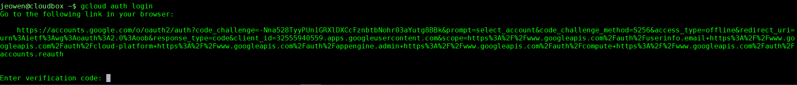

# Terraform Quickstart for Google Cloud GKE for SAS Viya 4.0.1

## Prerequisites

You will of course need access to a project in GCP, with GKE enabled. If you don't have that, request access here:  http://sww.sas.com/sites/it/cloud-services/.  If you are working with a brand new account, you may need to open up the web GCP console and go to GKE, and enable this service.   

### Tools

You are going to need a control machine which we will use for launching/controlling our Kubernetes cluster.  This is a machine that sits outside of the cluster.  It is used to issue commands to GCP (whether via `terraform` or `gcloud`), Kubernetes, etc.  Could be your laptop or some other jump box.  Here is a list of some of the CLI tools you will need on it:
 - `gcloud` for interacting with gcp 
 - `terraform` for creating the infrastructure.  Use version > 0.12.21
 - `kubectl` for interacting with your Kubernetes environment 
 - And a few utilities: `jq`, `git`, `wget` might all prove helpful
 - Strongly recommend that your host be integrated with SAS LDAP, and you become yourself for this whole excercise, so that you have access to your "U" drive.  

If you already have these tools on your laptop or some other jumphost, great, you are good to go.  If not, you have the option to ssh into a preconfigured machine at `cldlgn.fyi.sas.com`, or you can use <a href=https://gitlab.sas.com/xeno/cloudbox target="_blank">**this "cloudbox" project**</a> to easily create a VM on Openstack that will have everything you need.  

While Terraform supports multiple ways of authenticating to Google Cloud, for the sake of simplicity only Google Cloud Service Account method will be used as documented here.

### `gcloud` Setup

***Note - from this point forward in this README, we are working on obtaining a service account key file.  If you already have your service account and the private key file, then you are good to go and can skip straight to one of the deployment directories***

Even though `terraform` is going to be doing the bulk of the work in this project, we do need to make sure our `gcloud` tool is configured in order for us to take care of a few one-time set-up tasks within Google Cloud.  First of all, make sure the cli tool is working:

You should be connected to your kubectl host here and you should be the user you plan to manage this deployment (perhaps this is yourself: i.e. `su - jeowen`)

Reference:  
* https://cloud.google.com/sdk/gcloud/#configurations

Verify you have valid credentials:
```bash
gcloud auth list # do you have an active account?
gcloud config get-value core/account #is this the gcp project you want to use?
```
**IF** you do not have your desired account shown (you obviously won't if this is your first time working with `gcloud`), then you can first authenticate yourself with the CLI by running this command:
```bash
gcloud auth login
```
We will get this prompt from the command line: 


You then follow the instructions to the specified URL to log in (use your SAS email address) and provide the generated token back to the CLI.  

Once authenticated, you can then check on the cli config.  
```bash
gcloud config get-value core/project #are you in the right project?  
gcloud config get-value compute/zone #are you in the right zone?
```
**IF** your config does not look right, run this command and follow the wizard to get your `gcloud` cli tool configured (you probably just want to update the default profile - option 1).  Make sure you choose your account and ***your*** project, also choose a default region/zone - any should work.  
```bash
gcloud init
```
**IF** you are still having problems or if you want to change a single value without going through the whole wizard again, you can also run commands like this to set these values one at a time:
```bash
gcloud config set project #yourproject#
gcloud config set compute/zone #yourgcpzone#
```
> (Hint - use `gcloud projects list` to see all projects your account can see.  This will be a long list.  There is probably one or at most a handful that you actually have permissions to use.)  

##### CLI FYI:
- see all config settings: `gcloud config list`
- defaults and config are stored at `~/.config/gcloud/configurations/` (one file per configuration profile here)
- tokens stored at `~/.config/gcloud/access_tokens.db`
- subscriptions stored at `~/.config/gcloud/`
- anytime you'd like a fresh start you can safely run `rm -rf ~/.config/gcloud/`.  Then, you'll need to `gcloud init` + `az configure` again.  *You might want to make a habit of ending every session with removal of `~/.config/gcloud/` for security reasons.*  


### Google Cloud Service Account + Key

***Reminder - this is just a one time step here.  Goal is to create a new service account and obtain a valid key file for it***  

Reference:
* Understanding service accounts - https://cloud.google.com/iam/docs/service-accounts
* Understanding service account keys - https://cloud.google.com/iam/docs/creating-managing-service-account-keys

The preferred method that terraform would like us to use for authenticating ourselves to Google Cloud is via a service account.  Specifically, a json file containing a private key associated with a service account.  (You might think that we should just use the same credentials that the `gcloud` cli tool uses locally - no, we do not want to do that because according to terraform: *"some APIs are not compatible with credentials obtained through gcloud"*).

In this section we will create a new Google Cloud Service Account and a private key file.  

Copy and paste these variables as-is to your shell:
```bash
GCPPROJECT=$(gcloud config list --format="value(core.project)")
GCPREGION=$(gcloud config list --format="value(compute.region)")
GCPZONE=$(gcloud config list --format="value(compute.zone)")
GCPACCOUNT=$(gcloud info --format='value(config.account)')
TFSA=$USER-tf-gke-service-account
```
If this is your first time using terraform with Google Cloud, you will need to create a new service account dedicated to this terraform project.  List all service accounts if interested:
```bash
gcloud iam service-accounts list
```
Assuming you don't quite see the service account you need, go ahead and create a new one:
```bash
gcloud iam service-accounts create $TFSA  --description "sa used for all terraform actions for gke" --display-name "$TFSA"
```
And make sure to give this new service account OWNER role to your project.  (please keep the keys you are getting ready to create very secure).
```bash
gcloud projects add-iam-policy-binding $GCPPROJECT --member serviceAccount:${TFSA}@${GCPPROJECT}.iam.gserviceaccount.com  --role roles/owner
```
And now create the key that will allow `terraform` to authenticate as this user.  (replace `/tfsa-key.json` with the secret/protected path/name of the file you want to use for the key)
```bash
gcloud iam service-accounts keys create ~/.config/gcloud/tf-gke-service-account.json --iam-account ${TFSA}@${GCPPROJECT}.iam.gserviceaccount.com
```
List keys associated with the new service account
```bash
gcloud iam service-accounts keys list --iam-account ${TFSA}@${GCPPROJECT}.iam.gserviceaccount.com
```
View all IAM permissions (role + member bindings) that exist in your project.  You want your "TFSA" serviceAccount to be bound to an owner role.  
```bash
gcloud projects get-iam-policy ${GCPPROJECT}
```
You should also probably delete this key when you are done with it:
```bash
gcloud iam service-accounts keys delete [KEY-ID]  --iam-account ${TFSA}@${GCPPROJECT}.iam.gserviceaccount.com
```
And perhaps disable the service account:
```bash
gcloud iam service-accounts disable ${TFSA}@${GCPPROJECT}.iam.gserviceaccount.com
#or
gcloud iam service-accounts delete ${TFSA}@${GCPPROJECT}.iam.gserviceaccount.com
```

Now you are ready for terraform-ing.  Go to the ["main READMEl"](./README.md).


## Terraform Reference 
* Learning path
    * https://learn.hashicorp.com/terraform?track=gcp#gcp
* Book - https://learning.oreilly.com/library/view/terraform-up/9781492046899/  
* Modules Registry - https://registry.terraform.io
* What is a module - https://www.terraform.io/docs/configuration/modules.html
* Google Cloud terraform provider - https://www.terraform.io/docs/providers/google/guides/provider_reference.html
* Best practices - https://www.terraform-best-practices.com
* Benefits - https://blog.gruntwork.io/why-we-use-terraform-and-not-chef-puppet-ansible-saltstack-or-cloudformation-7989dad2865c

## Possibilities and next steps
* Advanced configurations - 
* GitlabCI/CD + Terraform Webinar - https://www.hashicorp.com/resources/accelerating-digital-transformation-at-northwestern-mutual-with-terraform-and-git
* Cloud Resources visualization 
    * https://github.com/28mm/blast-radius
* Testing
    * https://terratest.gruntwork.io/docs/getting-started/quick-start/


